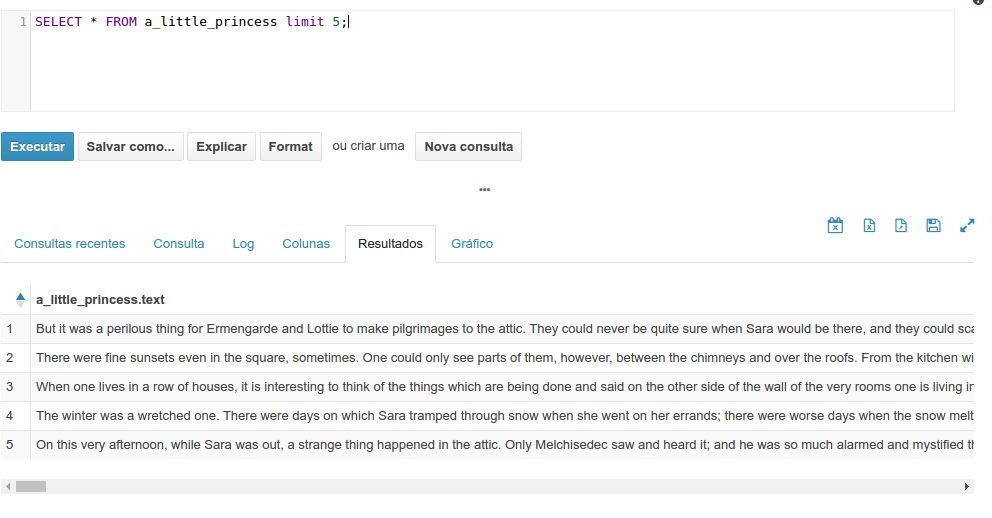
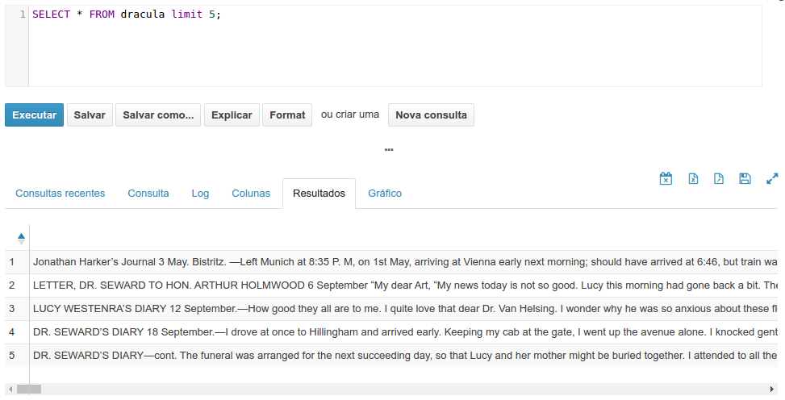
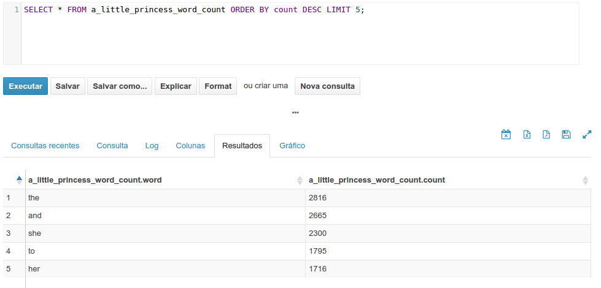
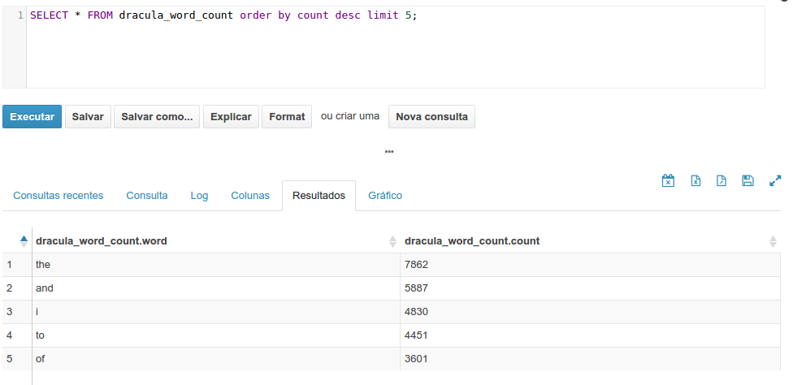
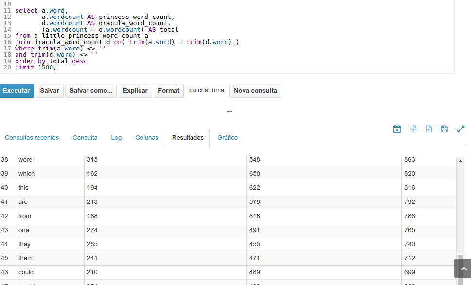
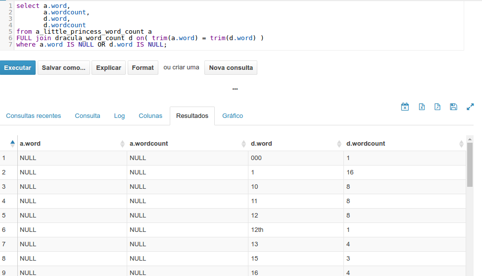

# MapRecude

### Equipe
[Adriano de Souza Barbosa](https://github.com/adrianosb)

[André Matsuda](https://github.com/andrematsuda)

### Atividades:
1. Encontrar o vocabulário comum de 1.500 palavras entre 2 livros;
2. Encontrar o vocabulário de palavras diferente de cada livro entre 2 livros removendo as palavras que forem encontradas nos dois livros;

### Pré-requisito
#### 1. Executar passos na raiz deste projeto
#### 2. Extrair conteúdo do livros para arquivos .txt
> Rodar o comando: java -jar HtmlToText.jar path_livro
```sh
$ java -jar HtmlToText.jar ./HtmlToText/lit2go.ok
```
#### 3. Extrair conteúdo das legendas das séries para arquivos .txt
> Rodar o comando: java -jar SrtToText.jar path_legendas_series
```sh
$ java -jar SrtToText.jar ./SrtToText/series
```

#### 4. Copiar os resultados (arquivos .txt) para hadoop
```sh
$ hadoop fs -mkdir lit2go.ok #cria diretório para livro
$ hadoop fs -mkdir series #cria diretório para series

$ hadoop fs -put ./result_books/ ./lit2go.ok/ #copia livros para hadoop
$ hadoop fs -put ./result_series/ ./series/ #copia series para hadoop
```

#### 5. Configurar Hive para trabalhar recursivamente
Entra no Hive e executar:
```sh
SET hive.mapred.supports.subdirectories=TRUE;
SET mapred.input.dir.recursive=TRUE;
```

## Executando Atividades pelo Hive:
### 1. Encontrar o vocabulário comum de 1.500 palavras entre 2 livros;

#### Criar tabela do livro 'A little princess':
```sql
CREATE EXTERNAL TABLE a_little_princess
(text STRING)
ROW FORMAT DELIMITED
FIELDS TERMINATED BY '\t'
LINES TERMINATED BY '\n'
STORED AS TEXTFILE
LOCATION '/user/root/lit2go.ok/result_books/A_Little_Princess/';
```
Trocar '/user/root/' pelo seu caminho onde criou a pasta result_books no hadoop

#### Testando a tabela 'A little princess'
```sql
SELECT * FROM a_little_princess limit 5;
```


#### Criar tabela do livro 'Dracula':
```sql
CREATE EXTERNAL TABLE dracula
(text STRING)
ROW FORMAT DELIMITED
FIELDS TERMINATED BY '\t'
LINES TERMINATED BY '\n'
STORED AS TEXTFILE
LOCATION '/user/root/lit2go.ok/result_books/Dracula/';
```

#### Testando a tabela 'Dracula'
```sql
SELECT * FROM dracula limit 5;
```


#### Criar tabela do livro 'A little princess' com word count :
```sql
CREATE TABLE a_little_princess_word_count AS
SELECT word, (count(*)) wordcount
FROM a_little_princess LATERAL VIEW explode(split(lower(text), '\\W+')) t1 AS word
GROUP BY word
order by word;
```

#### Testando a tabela 'A little princess' com word count
```sql
SELECT * FROM a_little_princess_word_count limit 5;
```


#### Criar tabela do livro 'Dracula' com word count :
```sql
CREATE TABLE dracula_word_count AS
SELECT word, (count(*)) wordcount
FROM dracula LATERAL VIEW explode(split(lower(text), '\\W+')) t1 AS word
GROUP BY word
order by word;
```

#### Testando a tabela 'Dracula' com word count
```sql
SELECT * FROM dracula_word_count limit 5;
```



#### Encontrar o vocabulário comum de 1.500 palavras entre 2 livros (intersecção)
```sql
select a.word, 
       a.wordcount AS princess_word_count, 
       d.wordcount AS dracula_word_count, 
       (a.wordcount + d.wordcount) AS total
from a_little_princess_word_count a  
join dracula_word_count d on( trim(a.word) = trim(d.word) ) 
where trim(a.word) <> '' 
and trim(d.word) <> ''
order by total desc
limit 1500;
```

Resultado: [**interseccao.csv**](interseccao.csv)




### 2. Encontrar o vocabulário de palavras diferente de cada livro entre 2 livros removendo as palavras que forem encontradas nos dois livros (disjunção)
```sql
select a.word, 
       a.wordcount, 
       d.word, 
       d.wordcount
from a_little_princess_word_count a  
FULL join dracula_word_count d on( trim(a.word) = trim(d.word) ) 
where a.word IS NULL OR d.word IS NULL;
```

Resultado: [**disjuncao.csv**](disjuncao.csv)



# Resultdo final para os livros: 'A little princess' e 'Dracula'
1. Encontrado o vocabulário comum (intersecção) de 1.500 palavras entre 2 livros  [**CSV**](interseccao.csv)
2. Encontrado o vocabulário de palavras diferente (disjunção) de cada livro entre 2 livros removendo as palavras que forem encontradas nos dois livros  [**CSV**](disjuncao.csv)
